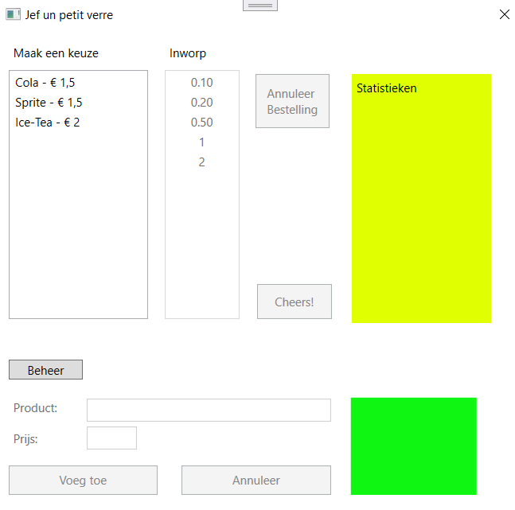

# PE: Drankenautomaat
## Lay-out
Er is reeds een lay-out aanwezig, maar je mag die zeker aanpassen (gebruik gerust je eigen creativiteit).

Lay-out bij opstarten:

Lay-out na bestelling:

Lay-out voor beheer:

Het programma in werking:

Geef de controls waar nodig namen die voldoen aan de afspraken rond de notatie van identifiers.

## Functionaliteiten
### Opstart
- Via lists worden de volgende gegevens bijgehouden
  - namen van dranken
  - prijzen van dranken
  - aantal verkochte exemplaren per drank
 > Deze drie instanties van List<T> worden bij het opstarten geïnstanteerd en opgevuld met de gegevens van 3 producten.
 > Op de index 0 van elke van deze instanties komen de naam, prijs en aantal verkochte exemplaren van de eerste drank (0 bij het opstarten), op index 1 die van de 2de drank, etc.
- De namen en prijzen van de dranken worden opgeladen in de linker listbox. Overloop hiervoor de lists met de namen en de prijzen.
- De waarden van de munten van 10 cent tot en met 2 euro worden opgeladen in de rechter listbox
- De listbox voor de inworp is enkel beschikbaar als er effectief een product is gekozen
- De grid voor het beheer is niet beschikbaar

### Beschikbaarheid
Tijdens het programma wordt de beschikbaarheid van de controls en de grids regelmatig gewisseld. Om dit in de code overzichtelijker te krijgen, kun je werken met de methode ChangeWorkingMode.

Hierin kun je alle grids en controls verzamelen in een list van FrameWorkElementen. Die kun je dan overlopen en één voor één uitschakelen.

Gebruik de elementen uit de enum WorkingStates om te bepalen in welk soort modus je aan het werken bent. Schakel de grids/controls terug in die je voor die modus nodig hebt.

### Een drank toevoegen
- Door een klik op de knop 'Beheer' wordt de grid met de controls voor het beheer beschikbaar.
  De grid voor de bestellingen is niet beschikbaar.
- Bij een klik op 'Voeg toe' worden een product en zijn prijs toegevoegd, tenzij de gegevens niet 'valied' zijn (zie verder).
- Bij ongeldige gegevens wordt eventueel een foutboodschap (zie ook het stukje over validiteit) in de text block. Daarna wordt de foutboodschap aangepast bij elke wijziging in één van de textboxen.

- Na het toevoegen of bij een klik op 'Annuleer'
  - wordt het beheerscherm uitgeschakeld,
  - wordt de grid voor de bestellingen terug bruikbaar,
  - worden de textboxen en het textblock in de beheersgrid leeg gemaakt.

### Validiteit van de gegevens van een drank
Om een geldig product aan te maken moet aan de volgende voorwaarden voldaan worden:
- De naam van het product moet min. 3 letters tellen.
- De prijs moet een geldig, positief decimaal getal zijn
Wanneer er een fout gemaakt wordt in de input, wordt een exception gegooid met een passende foutboodschap.
Vermijd in elk geval dat er op de 'Voeg Toe'-knop geklikt kan worden als de input niet geldig is.

### Een drank bestellen
- Als er een product geselecteerd wordt, wordt het nog te betalen saldo getoond.
- De listbox voor de inworp van muntstukken en de knop om te annuleren worden beschikbaar.
- De listbox moet de producten wordt uitgeschakeld.

### Een bestelling annuleren
Bij een klik op de knop 'Annuleer Bestelling' wordt
- deze knop uitgeschakeld
- de listbox voor de inworp van muntstukken uitgeschakeld.
- de listbox moet de producten ingeschakeld.
- het label met het saldo verborgen/leeg gemaakt.

### Betalen
- Bij elke klik op een bedrag in de listbox met de inworp, wordt het te betalen saldo bijgewerkt. Let erop dat je 2 maal na elkaar op hetzelfde bedrag moet kunnen klikken.
- Eens het bedrag volledig betaald is:
  - Wordt het wisselgeld berekend en getoond.
  - Worden de statistieken bijgewerkt en getoond.
  - Verschijnt er een passende boodschap onder de listbox voor de inworp
  - Wordt de listbox voor de inworp uitgeschakeld
  - Wordt de 'Cheers'-knop ingeschakeld.

### Consumptie nemen
Een klik op de knop 'Cheers!' herstelt de beginsituatie. De productenlijst en de statistieken worden echter niet vernieuwd.

## Afspraken  
- Denk eraan om voor identifiers het Engels te gebruiken (naast Google kan mijnwoordenboek.nl je nieuwe 'best friend' worden). 
- Gebruik variabelen overal waar waarden opgeslagen worden. Gebruik geen instance variabele als dit niet strikt gezien nodig is. 
- Declareer de variabelen binnen de kleinst mogelijke scope.
- Werk zo veel mogelijk met methoden. Maak hierbij optimaal gebruik van parameters en return types.
- Beperk de lengte van methoden. 20 statements is het maximum. Enige uitzondering hierop is ChangeWorkingMode. 
- In een event handler method mogen er in principe enkel de volgende zaken voorkomen:
 - Declaratie van lokale variabelen
 - Inlezen van de input van de gebruiker
 - Toewijzen van waarden aan de variabelen (indien eenvoudig statement)
 - Call(s) naar eigen methoden
 - Feedback naar de gebruiker
## Score
- Het respecteren van de afspraken zoals hierboven beschreven en die rond naamgeving en codering
- De mate waarin de applicatie fool proof en gebruiksvriendelijk is. Hieronder verstaan we ook de validatie (checken of de gegevens correct/volledig zijn vooraleer ze opgeslagen worden) van gegevens.
- Algemene werking van de applicatie
- De leesbaarheid en onderhoudbaarheid van de code
- Solutions die bij de start compileerfouten of errors geven, worden niet geëvalueerd = 0.
- De commits weerspiegelen een gestructureerde en planmatige manier van werken, volgens de afgesproken gitconventies.

